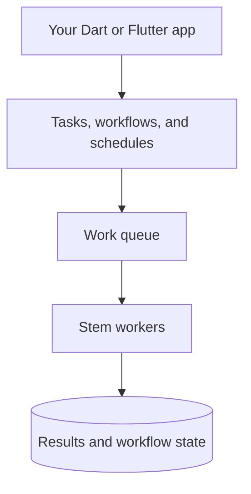

<p align="center">
  
</p>

<p align="center">
  <strong>Background jobs and durable workflows for Dart</strong><br>
  Define work in Dart. Run it locally, in Flutter, or in a server worker.
</p>

<p align="center">
  <a href="https://pub.dev/packages/stem"></a>
  <a href="https://github.com/kingwill101/stem/actions/workflows/aggregate.yaml"></a>
  <a href="https://opensource.org/licenses/MIT"></a>
</p>

---

## Why Stem?

Use Stem when work should run outside a request, retry after failure, or wait
between steps without keeping a Dart function alive.

- **Background tasks** — Typed inputs and results, retries, queues, and schedules.
- **Workflows** — Named checkpoints, durable waits, and retry/compensation policies.
- **Storage choices** — Start in memory; add SQLite, Redis, or PostgreSQL when
  you need persistence. Each adapter has its own platform and deployment requirements.
- **Operations** — Inspect work through the CLI, signals, and OpenTelemetry.

Stem is **experimental and pre-1.0**. Test your application's failure and recovery
paths before production use. Native adapters and isolate workers are not available
on every platform; see the [portable runtime guide](packages/stem/doc/portable-runtime.md).

## Start with your use case

| I want to… | Start here |
| --- | --- |
| Try a workflow without a database or code generation | [First workflow](#quick-start) below |
| Send typed background tasks to workers | [Generated tasks](packages/stem_builder/README.md) |
| Resume work after a process restart | [Persistent workflow hosts](packages/stem/doc/workflow_host.md#persistent-restart) |
| Show workflow progress in Flutter | [Flutter host bindings](packages/stem_flutter/README.md) |
| Store Flutter work locally | [Flutter SQLite setup](packages/stem_flutter_sqlite/README.md) |
| Choose storage and deployment options | [Backend guide](.site/docs/getting-started/choosing-a-backend.md) |
| Understand the runtime one concept at a time | [Documentation](https://kingwill101.github.io/stem/) |

---

## Quick Start

This checkout targets **Dart 3.13+**. Repository docs describe the source on this
branch; published versions can lag behind it. When using pub.dev, check the
documentation and SDK requirements for the version you resolve.

Create a console application and add Stem:

```bash
dart create -t console stem_demo
cd stem_demo
dart pub add stem
```

With a Stem version that includes `WorkflowHost`, replace `bin/stem_demo.dart`
with this complete example:

```dart
import 'package:stem/stem.dart';

final greeting = HostedWorkflow<String, String>(
  name: 'greeting',
  run: (context, name) async {
    final cleaned = await context.step('normalize', () => name.trim());
    return 'Hello, $cleaned!';
  },
);

Future<void> main() async {
  final host = await WorkflowHost.inMemory(workflows: [greeting]);
  try {
    final run = await host.submit(greeting, ' Ada ');
    print(await run.result);
  } finally {
    await host.close();
  }
}
```

Run `dart run`. Expected output: `Hello, Ada!`.

The host starts and owns its runtime and worker. `context.step` saves a named
checkpoint, and `run.result` waits for the typed result. The step body runs
locally in the workflow execution; it is not a separately queued remote task.

**This example is process-local.** In-memory checkpoints disappear when the
process exits. To make runs survive a restart, configure durable storage,
re-register the workflow definitions, and retain run IDs. Follow the
[workflow host guide](packages/stem/doc/workflow_host.md) for that next step.

For independent background jobs rather than multi-step orchestration, start
with [generated typed tasks](packages/stem_builder/README.md). For a typed
task without code generation, see the [core package example](packages/stem/README.md).

---

## Architecture

Define work in Dart. Stem queues it, runs it in workers, and makes task results
and workflow state available to your application.



Choose **in-memory, SQLite, Redis, or PostgreSQL** adapters for the queue and
stores. Capabilities vary by adapter; in-memory state is process-local.
See the [workflow host guide](./packages/stem/doc/workflow_host.md) for
checkpointing, retries, compensation, and recovery.

---

## Packages

| Package | Description | pub.dev |
|---------|-------------|---------|
| [`stem`](./packages/stem) | Core runtime: contracts, worker, scheduler, in-memory adapters, signals, Canvas, workflows | [](https://pub.dev/packages/stem) |
| [`stem_cli`](./packages/stem_cli) | Command-line tooling (`stem` executable) and CLI utilities | [](https://pub.dev/packages/stem_cli) |
| [`stem_memory`](./packages/stem_memory) | Compatibility package for the explicit `package:stem/memory.dart` in-memory library | [](https://pub.dev/packages/stem_memory) |
| [`stem_sqlite`](./packages/stem_sqlite) | SQLite queue, results, and workflow storage for local persistence | [](https://pub.dev/packages/stem_sqlite) |
| [`stem_redis`](./packages/stem_redis) | Redis Streams broker, result backend, and watchdog helpers | [](https://pub.dev/packages/stem_redis) |
| [`stem_postgres`](./packages/stem_postgres) | Postgres broker, result backend, and scheduler stores | [](https://pub.dev/packages/stem_postgres) |
| [`stem_flutter`](./packages/stem_flutter) | Flutter bootstrap, workflow host lifecycle, and progress widgets | [](https://pub.dev/packages/stem_flutter) |
| [`stem_flutter_sqlite`](./packages/stem_flutter_sqlite) | Managed SQLite storage and Ormed setup for Flutter Stem apps | [](https://pub.dev/packages/stem_flutter_sqlite) |
| [`stem_builder`](./packages/stem_builder) | Build-time code generator for annotated tasks and workflows | [](https://pub.dev/packages/stem_builder) |
| [`stem_adapter_tests`](./packages/stem_adapter_tests) | Shared contract test suites for adapter implementations | [](https://pub.dev/packages/stem_adapter_tests) |
| [`stem_dashboard`](./packages/dashboard) | Hotwire-based operations dashboard (experimental) | — |

---

## Learn the next piece

| Topic | Guide |
| --- | --- |
| Task definitions, arguments, and results | [Typed tasks and code generation](packages/stem_builder/README.md) |
| Parallel and sequential task composition | [Canvas](.site/docs/core-concepts/canvas.md) |
| Delayed and recurring jobs | [Scheduling](.site/docs/scheduler/beat-guide.md) |
| Workflow sleeps, events, retries, and compensation | [Workflow hosts](packages/stem/doc/workflow_host.md) |
| Inspecting workers, schedules, and failed deliveries | [CLI setup and commands](packages/stem_cli/README.md) |
| Deployment and failure handling | [Production checklist](.site/docs/getting-started/production-checklist.md) |

### Reliability rules to know early

- **Execution can repeat.** Use idempotency keys for external side effects.
  Checkpoints do not make a payment, email, or HTTP request exactly-once.
- **Persistence requires persistent adapters.** Keep the queue and relevant
  stores durable, and keep workflow names, step names, and codecs compatible
  across deployments.
- **Closing a host is not cancelling a run.** It stops local observation and
  owned resources. Cancellation is explicit and does not undo external effects.
- **Mobile execution follows OS lifecycle limits.** Flutter bindings do not
  keep an application running after the OS suspends or terminates it.

## AI coding assistants

Stem's package skills teach agents the supported task, workflow, code generation,
Flutter lifecycle, and SQLite patterns. They are shipped under each package's
`skills/` directory, not as a separate runtime dependency.

For a dependency version that includes skills:

```bash
dart run skills@ get -p stem
```

The command lets you select the skills to install into your project's agent
directory. Skills added in this repository are not available from older pub.dev
releases. See [AI assistant setup](.site/docs/getting-started/ai-skills.md) for
package selection, local development, and the distinction between shipped
package skills and repository contributor instructions.

---

## Development

### Prerequisites

- Dart 3.13.0+
- Flutter 3.47.0+ (for the local Flutter package gate)
- Docker (for adapter integration tests)
- Nix and devenv 2.2+ (recommended workspace environment)

### Setup

```bash
# Clone the repository
git clone https://github.com/kingwill101/stem.git
cd stem

# Enter the pinned workspace environment
devenv shell

# Discover the workspace and run the centralized quality/test gate
stem-workspace
stem-quality
stem-standalone
stem-test
```

The root [`repodoc`](./repodoc/README.md) package owns workspace discovery,
dependency resolution, tests, coverage, examples, standalone package
resolution, and job profiling. The `devenv.nix` scripts expose those commands
with a cached compiled binary so the same entrypoints are available locally
and in CI. The Taskfile is only a compatibility wrapper; repodoc does not
invoke it.

### Adapter Tests

Integration tests require the Docker test stack:

```bash
# Run all package tests with Docker-backed integration env
devenv shell -- stem-test

# Run coverage workflow for core adapters/runtime packages
devenv shell -- stem-coverage

# Run targeted adapter suites (auto-bootstraps integration env)
devenv shell -- repodoc test:contract
devenv shell -- repodoc test:redis
devenv shell -- repodoc test:postgres
```

### Profile worker jobs

Use the profiling tasks when investigating runtime performance rather than
relying on a single test-suite timing:

```bash
# Five fresh AOT trials with medians and p95 summaries.
stem-profile --mode isolate --workload cpu --work-units 250

# Pause before execution and attach Dart DevTools through the VM service.
devenv shell -- repodoc profile:job:vm --mode isolate --workload cpu --work-units 250
```

The AOT profile writes a machine- and commit-stamped JSON artifact under
`build/stem-profile/`. The VM-service profile is intended for CPU, timeline,
isolate, and allocation inspection; see [`benchmark/README.md`](./benchmark/README.md)
for the full workflow and scenario options.

Targeted adapter tasks now bootstrap integration environment automatically.
If bootstrap still fails (for example Docker unavailable), run:

```bash
source ./packages/stem_cli/_init_test_env
```

Capability flags and skip behavior for adapter contract suites are documented in
[`packages/stem_adapter_tests/README.md`](./packages/stem_adapter_tests/README.md).

---

## Contributing

Contributions are welcome! Please read the contribution guidelines before submitting a PR.

1. Fork the repository
2. Create a feature branch (`git checkout -b feature/amazing-feature`)
3. Commit your changes (`git commit -m 'Add amazing feature'`)
4. Push to the branch (`git push origin feature/amazing-feature`)
5. Open a Pull Request

See [CONTRIBUTING.md](CONTRIBUTING.md) for the repository's development workflow.

---

## License

MIT License — see [LICENSE](packages/stem/LICENSE) for details.

---

<p align="center">
  <a href="https://www.buymeacoffee.com/kingwill101">
    
  </a>
</p>
