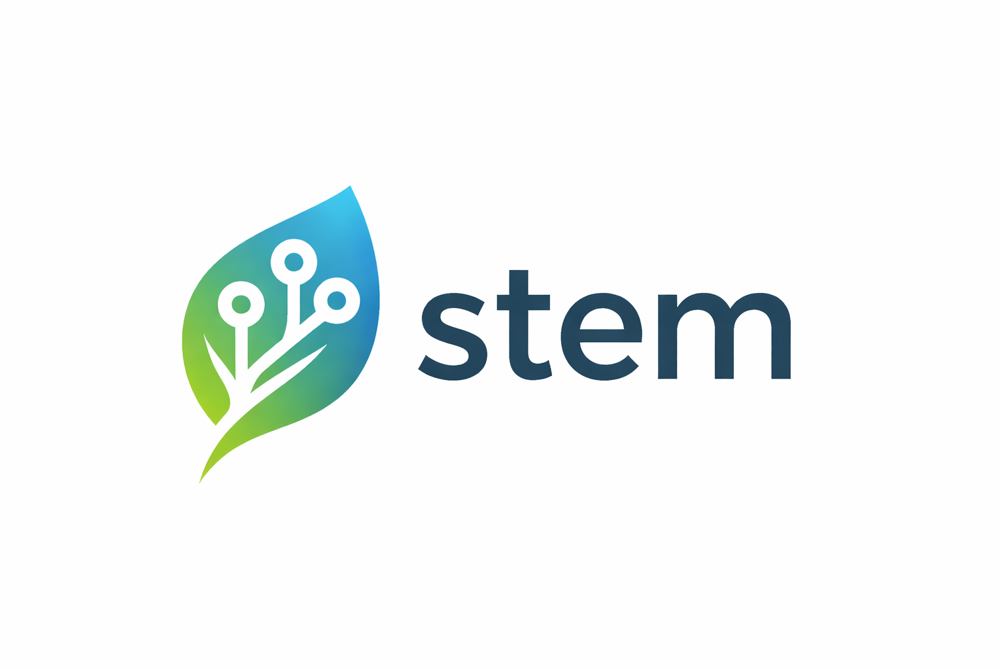

<p align="center">
  
</p>

# stem_sqlite

[](https://pub.dev/packages/stem_sqlite)
[](https://dart.dev)
[](https://github.com/kingwill101/stem/blob/main/LICENSE)
[](https://www.buymeacoffee.com/kingwill101)

SQLite broker and result backend implementations for the Stem runtime. Use it
to embed Stem into single-node or desktop deployments without external
infrastructure.

## Install

```bash
dart pub add stem_sqlite
```

Add the core runtime if you haven't already:

```bash
dart pub add stem
```

## Usage

### Direct enqueue

```dart
import 'dart:io';
import 'package:stem/stem.dart';
import 'package:stem_sqlite/stem_sqlite.dart';

Future<void> main() async {
  final registry = SimpleTaskRegistry()
    ..register(FunctionTaskHandler(name: 'demo.sqlite', handler: print));

  final dbFile = File('stem.db'); // or File(':memory:') for in-memory
  final broker = await SqliteBroker.open(dbFile);
  final backend = await SqliteResultBackend.open(dbFile);

  final stem = Stem(broker: broker, backend: backend, registry: registry);
  await stem.enqueue('demo.sqlite', args: {'name': 'Stem'});
}
```

### Typed `TaskDefinition`

```dart
import 'dart:io';
import 'package:stem/stem.dart';
import 'package:stem_sqlite/stem_sqlite.dart';

final demoSqlite = TaskDefinition<SqliteArgs, void>(
  name: 'demo.sqlite',
  encodeArgs: (args) => {'name': args.name},
  metadata: TaskMetadata(description: 'SQLite-backed demo task'),
);

class SqliteArgs {
  const SqliteArgs({required this.name});
  final String name;
}

Future<void> main() async {
  final registry = SimpleTaskRegistry()
    ..register(
      FunctionTaskHandler<void>(
        name: demoSqlite.name,
        entrypoint: (context, args) async {
          print('Hello ${(args['name'] as String?) ?? 'world'}');
        },
        metadata: demoSqlite.metadata,
      ),
    );

  final dbFile = File('stem.db'); // or File(':memory:') for in-memory
  final broker = await SqliteBroker.open(dbFile);
  final backend = await SqliteResultBackend.open(dbFile);

  final stem = Stem(broker: broker, backend: backend, registry: registry);
  await stem.enqueueCall(demoSqlite(const SqliteArgs(name: 'Stem')));
}
```

### CLI usage

The Stem CLI can target a SQLite result backend via a connection string. When
you only need backend-backed commands, set a memory broker alongside the SQLite
URL:

```bash
export STEM_BROKER_URL=memory://
export STEM_RESULT_BACKEND_URL=sqlite:///absolute/path/to/stem.db

stem observe tasks show --id <task-id>
```

Broker-required commands (enqueue, control, DLQ replay) still need a real
broker URL.

## Tests

The package bundles compliance tests from `stem_adapter_tests`. Running

```bash
dart test
```

executes the shared broker and backend contract suites against the SQLite
adapters.

## Support

Report issues or feature requests on the
[GitHub tracker](https://github.com/kingwill101/stem/issues). Commercial support
is available via [Buy Me A Coffee](https://www.buymeacoffee.com/kingwill101).
